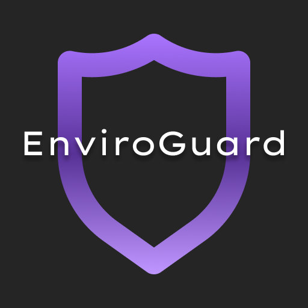

# EnviroGuard 溫濕度監測網
### 專案連結：[enviroguard.vercel.app](https://enviroguard.vercel.app/)

### _“Stay Safe, Stay Informed”_   _- EnviroGuard Watches Over Your Environment._

# 專案介紹
本專案為 **即時溫室度監測網站** ，由 Vite 建構，使用 React 搭配 Tailwind CSS 撰寫，亦提供 RWD, PWA 功能方便使用者操作。設備端由 ESP8266 開發板串接 DHT 溫濕度感測器，使用類 C++ 語言撰寫程式。設備端與前端網頁兩者搭配 Ably 所提供之 MQTT 通訊方式開發而成，實現遠端 IoT 應用功能。

### 功能 (本網站，不含感測器)
- 即時溫度監測 (每20秒自動更新)
- 即時濕度監測 (每20秒自動更新)
- 感測器所在縣市氣象觀測及預報
- 具響應式網頁設計 (RWD)
- 支援漸進式網路應用程式 PWA (Progressive Web Application) 功能，可在電腦、平板、手機上輕鬆查看
#### 功能 (感測器的部份)
  - LINE Notify 警報功能 (超過設定溫濕度閾值會發送 LINE 訊息通知使用者)
  - LED 警示燈指示 (方便使用者從外觀檢視有無正常連線)

### 使用簡介

# 環境需求
### 開發時使用環境：
- NVM v0.39.3
- Node.js v20.10.0
### 環境檔設定
- VITE_WEATHER_AUTHORIZATION_KEY: 中央氣象局 API token
- VITE_ABLY_KEY: Ably API Token

## 開發工具
- React v18.2.0
- Vite v5.0.0
- Tailwind CSS v3.3.6
- Ably v1.2.48
- Axios v1.6.2
- dayjs v1.11.10
- prop-types v15.8.1
- react-dom v18.2.0
- react-icons v4.12.0
- react-router-dom v6.21.0
- vite-plugin-pwa v0.17.4
- workbox-window v7.0.0
