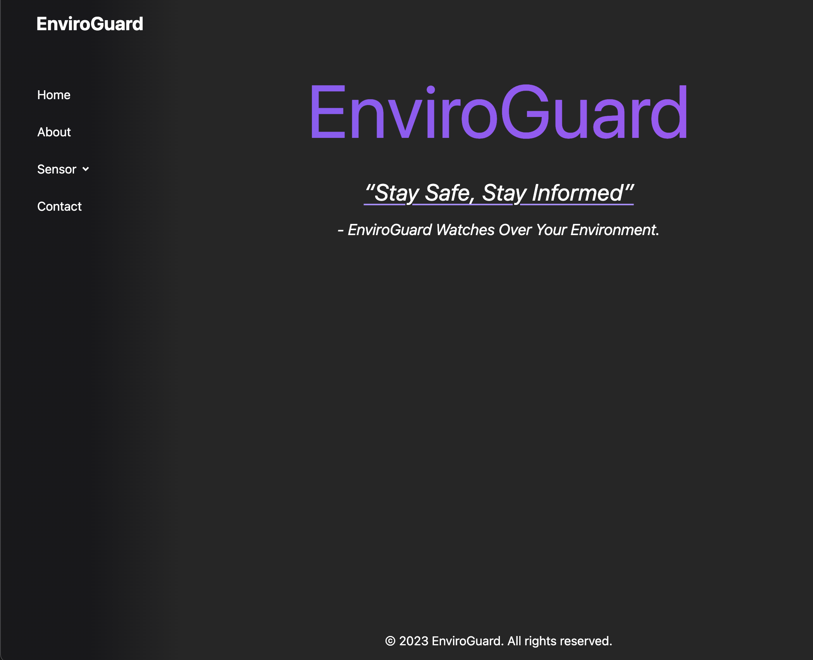
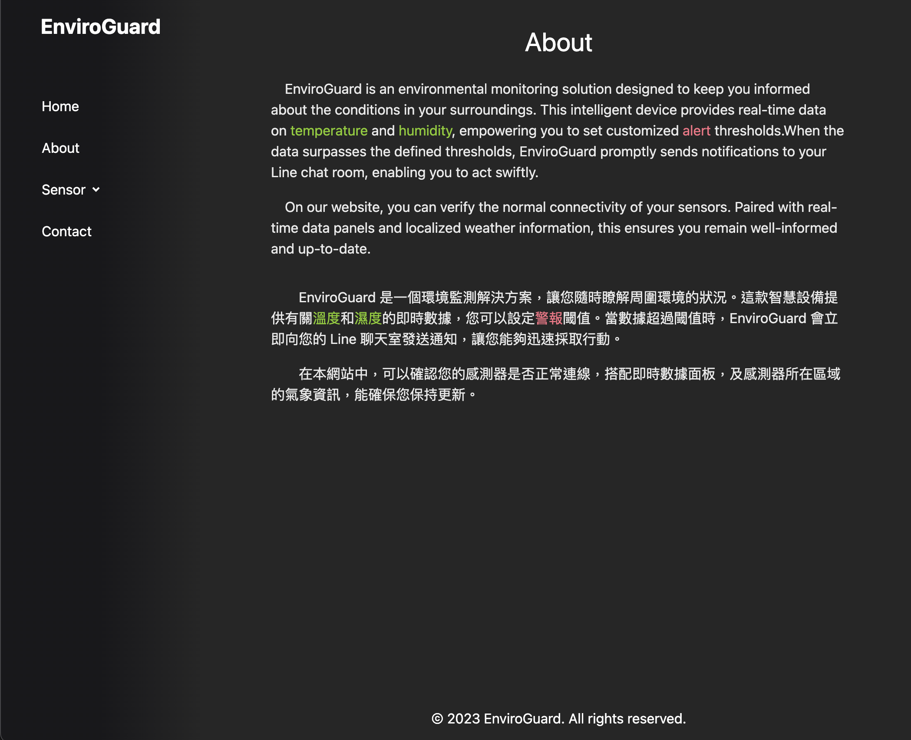
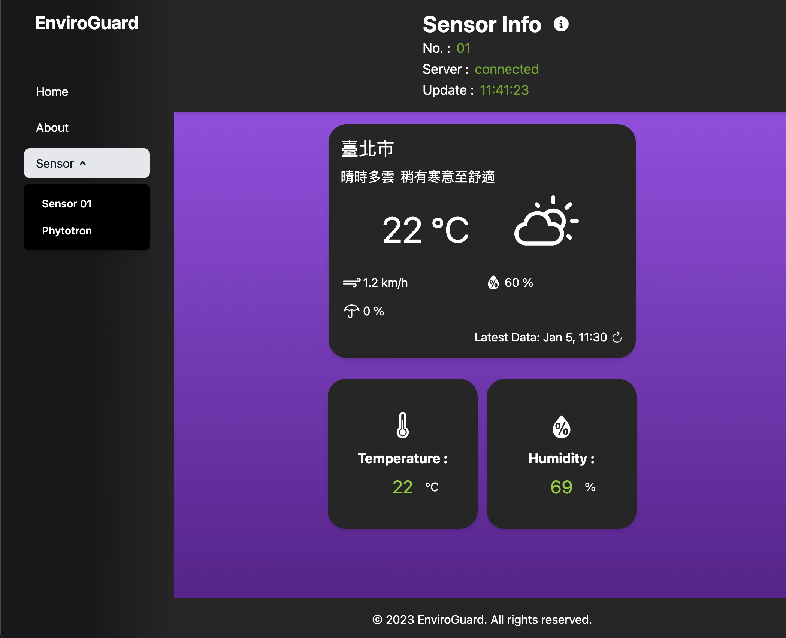
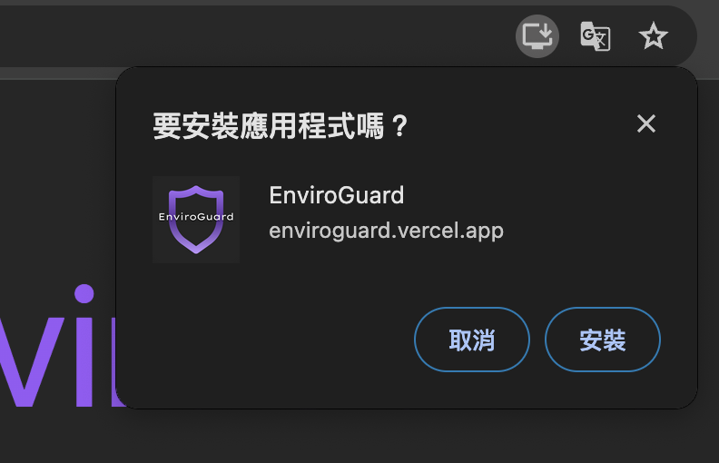

# EnviroGuard 溫濕度監測網
### 專案連結：[enviroguard.vercel.app](https://enviroguard.vercel.app/)

### _“Stay Safe, Stay Informed”_   _- EnviroGuard Watches Over Your Environment._

# 專案介紹
本專案為 **即時溫室度監測網站** ，由 Vite 建構，使用 React 搭配 Tailwind CSS 撰寫，亦提供 RWD, PWA 功能方便使用者操作。設備端由 ESP8266 開發板串接 DHT 溫濕度感測器，使用類 C++ 語言撰寫程式。設備端與前端網頁兩者搭配 Ably 所提供之 MQTT 通訊方式開發而成，實現遠端 IoT 應用功能。

### 功能 (本網站，不含感測器)
- 即時溫度監測 (每20秒自動更新)
- 即時濕度監測 (每20秒自動更新)
- 溫濕度最後訊息保存 (可顯示斷線前最後發送資訊)
- 感測器所在縣市氣象觀測及預報
- 具響應式網頁設計 (RWD)
- 支援漸進式網路應用程式 PWA (Progressive Web Application) 功能，可在電腦、平板、手機上輕鬆查看
#### 功能 (非本網站，屬於感測器的部份)
  - LINE Notify 警報功能 (超過設定溫濕度閾值會發送 LINE 訊息通知使用者)
  - LED 警示燈指示 (方便使用者從外觀檢視有無正常連線)

### 網站使用簡介

首頁左側具有側邊欄可選擇頁面，若是手機版則在上方。

About (關於) 頁面記錄本專案目前提供的功能。

Sensor 頁面提供了各感應器所在位置的天氣預報、溫度及濕度。依據各板塊資訊如下：

#### Sensor Info：
- No. 為感應器名稱或編號。
- Server 為頁面與 Ably主機連線狀態。
- Update 為溫濕度數值最後更新時間，由於採用 Will Message (最後訊息) 功能，進入頁面的第一刻會先顯示出感應器上次發出的最後一則訊息及更新時間。
- i 符號點入可開啟本頁說明對話框。

#### 氣象預報 (由上至下，由左至右欄位描述)：
- 感應器所在縣市。
- 氣象預測與體感描述。
- 觀測溫度及天氣圖。
- 風速、相對濕度、降雨機率數值。
- 數值最後更新時間 (官方每10-15分鐘更新觀測資訊)，本欄位對資訊更新頻率需求較低，故採手動更新，可點按右側更新按鈕。

#### 感測器溫度數值：
- 即時溫度，目前設定每 20 秒自動更新一次。
- 閾值預設 35 度，超過則轉變紅色警示字樣。

#### 感測器濕度數值：
- 即時濕度，目前設定每 20 秒自動更新一次。
- 閾值預設 85 %，超過則轉變紅色警示字樣。

 

Contact 頁面提供專案製作者的相關連絡資訊。

---
### PWA 漸進式網路應用程式：

以上 GIF 展示如何使用 PWA 功能，將本網站輕鬆置入手機桌面，讓網站 APP 化，不需打開瀏覽器也能快速開啟。本功能 iOS 及 Android 皆能使用。

在電腦版本的 Chrome 亦可使用此功能，僅需點按瀏覽器網址列的下載圖樣安裝。
 
 

# 環境需求
### 開發時使用環境：
- NVM v0.39.3
- Node.js v20.10.0
### 環境檔設定
- VITE_WEATHER_AUTHORIZATION_KEY: 中央氣象局 API token
- VITE_ABLY_KEY: Ably API Token

## 開發工具
- React v18.2.0
- Vite v5.0.0
- Tailwind CSS v3.3.6
- Ably v1.2.48
- Axios v1.6.2
- dayjs v1.11.10
- prop-types v15.8.1
- react-dom v18.2.0
- react-icons v4.12.0
- react-router-dom v6.21.0
- vite-plugin-pwa v0.17.4
- workbox-window v7.0.0
